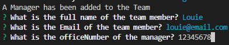
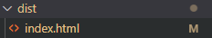

# Team-Profile-Generator
A command line interface (CLI) Node.js application that takes in information about employees on a software engineering team, then generates an HTML webpage that displays summaries for each person. Testing is key to making code maintainable, so you’ll also write a unit test for every part of your code and ensure that it passes each test.

## Table of Content

  - [Feature](#feature)
  - [Installation](#installation)
  - [Usage](#usage)
  - [Credits](#credits)
  - [License](#license)

## Feature

Create a Markdown file which suits your personal project needs.

## Installation

Step 1: Clone the repo (HTTPS: `git clone https://github.com/louieiply/Team-Profile-Generator.git` or SSH: `git clone git@github.com:louieiply/Team-Profile-Generator.git`)

Step 2: Install Node.js

Step 3: npm i inquirer (to install inquirer node library)

Step 4: npm i jest (to install jest node library)
## Usage

### Video

Here is a URL of a 
[Demonstration Video](https://youtu.be/K3A1isnZw4I)

### Screenshot

Firstly, you need to run "node index.js" to execute the application.

After you started to execute the application. Then you need to chose the role of your team member.

Then you need to fill out all the questions.

Once you finished enter the team member information, the application will ask you whether you finished adding team members or not.

.
If you have chosen no the application to ask you choose the role of the next team member

Once you have finished entering, a "index.html" file will be created in the "dist" folder.

You can run that html file and view the team member within your team.

## Credits

Github, shield.io, jest.js - npm.js,inquirer.js - npm.js

## License
[MIT License - Copyright (c) 2022 Louie Ip](./LICENSE)
